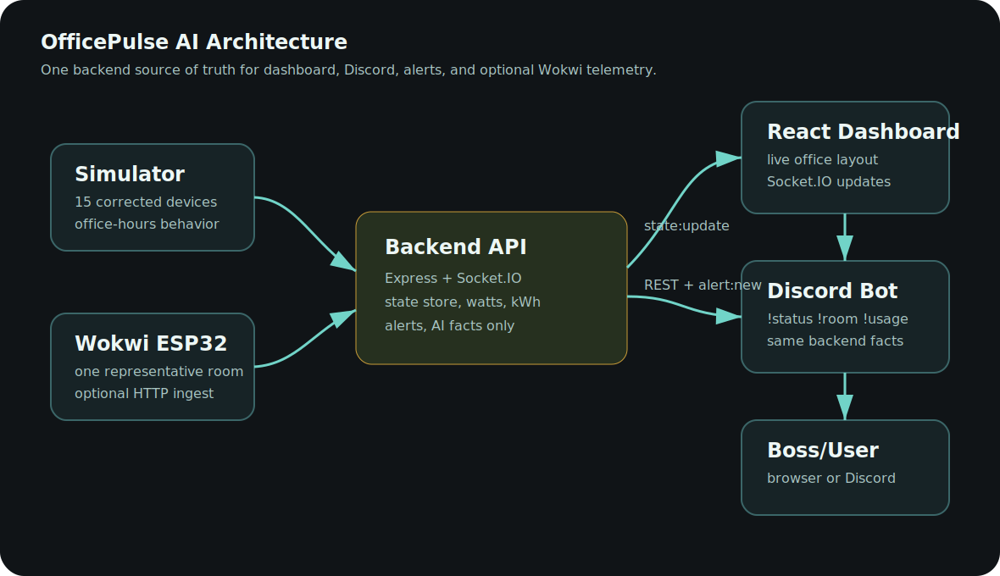

# OfficePulse AI

## 1. Problem Understanding

The office runs on Discord, but people leave lights and fans on after work. OfficePulse AI monitors the corrected v1.2 setup: 3 rooms, each with 2 fans and 3 lights, for 15 devices total.

Although some PDF sections still mention 18 devices, the v1.2 correction confirms the correct count is 15 devices. This implementation follows the corrected v1.2 office setup.

## 2. Solution Overview

OfficePulse AI is a real-time smart office monitoring system with one backend source of truth. The backend simulates device state, calculates power usage, detects alerts, serves REST APIs, emits Socket.IO events to the dashboard, and supplies the Discord bot with the same live facts.

## 3. Architecture

The system diagram is stored as `docs/system-diagram.svg`. It is an SVG diagram, not Mermaid.



Both the dashboard and Discord bot read from the same backend state store, so there is one source of truth for all device states, power usage, and alerts.

## 4. Technology Stack

Frontend: React + Vite.
Backend: Node.js + Express + TypeScript.
Real-time: Socket.IO.
Data store: in-memory backend state, accepted by the problem statement and reliable for demo.
Discord: discord.js with prefix commands and optional slash commands.
Hardware proof: Wokwi ESP32 representative room circuit docs and firmware.
AI: optional LLM humanizer with deterministic fallback.

## 5. Device Data Model

Rooms:

| Room | Devices |
| --- | --- |
| Drawing Room | Fan 1, Fan 2, Light 1, Light 2, Light 3 |
| Work Room 1 | Fan 1, Fan 2, Light 1, Light 2, Light 3 |
| Work Room 2 | Fan 1, Fan 2, Light 1, Light 2, Light 3 |

Power assumptions:

| Device type | Power when ON | Power when OFF |
| --- | ---: | ---: |
| Fan | 60W | 0W |
| Light | 15W | 0W |

Each device has `id`, `name`, `type`, `room`, `status`, `powerW`, `lastChanged`, `turnedOnAt`, and `source`.

## 6. Real-time Simulation

The backend simulator runs every 7 seconds. During office hours it prefers ON states; after hours it prefers OFF states and occasionally leaves Work Room 2 lights on to create realistic waste.

Demo controls are available in the dashboard:

| Control | Purpose |
| --- | --- |
| Simulate 10 PM forgotten devices | Forces after-hours alerts |
| Force Work Room 2 all ON for 2+ hours | Forces long-running room alerts |
| Simulate office hours | Shows normal live state |
| Reset office to normal | Clears demo state and kWh |

## 7. Alert Rules

After-hours alert: any device ON before 9 AM or after 5 PM.
Long-running room alert: all 5 devices in a room ON for more than 2 hours.
High power alert: total office power above 300W.
Idle room alert: all devices ON with no switch changes for a long time.

## 8. API Documentation

Full endpoint docs are in `docs/api.md`.

| Endpoint | Method | Purpose |
| --- | --- | --- |
| `/api/state` | GET | Full office state |
| `/api/rooms` | GET | All room states |
| `/api/rooms/:roomId` | GET | One room state |
| `/api/usage` | GET | Total/per-room power and kWh |
| `/api/alerts` | GET | Active and recent alerts |
| `/api/sim/toggle/:deviceId` | POST | Toggle one device |
| `/api/sim/scenario/night-forgotten` | POST | Force after-hours demo |
| `/api/sim/scenario/all-on/:roomId` | POST | Force all room devices ON |
| `/api/sim/reset` | POST | Reset demo state |
| `/api/iot/ingest` | POST | Optional Wokwi telemetry |

## 9. Discord Bot Commands

Every bot answer fetches the backend before replying.

| Command | Purpose |
| --- | --- |
| `!status` | Office-wide live status |
| `!room work1` | Specific room status |
| `!usage` | Current power and today kWh |
| `!alerts` | Active alerts |
| `!worst-room` | Highest consuming room |
| `!summary` | AI-humanized summary with fallback |
| `!help` | Command list |

Optional slash commands can be registered with `npm run register:commands -w @officepulse/bot` after setting Discord environment variables.

## 10. Wokwi Circuit

Circuit guide: `hardware/pin-mapping.md`.
Firmware: `hardware/firmware/officepulse_room.ino`.
Schematic diagram: `docs/hardware-schematic.svg`.
Public Wokwi link and screenshot: `hardware/wokwi-link.md`, `hardware/wokwi-screenshot.png`.

The representative circuit uses one ESP32 room with 5 switches, 3 yellow light indicators, 2 blue fan indicators, 220 ohm LED resistors, and optional ADC current simulation. Real deployment would use relay/SSR modules for AC loads. The problem statement says not to generate complete Wokwi project exports, so this repo includes the wiring guide, firmware, screenshot, and public Wokwi link instead of committing a full `diagram.json`.

## 11. AI Integration

AI is used only to rewrite backend-calculated facts into friendly text. If `OPENAI_API_KEY` is missing or the API fails, the bot and summary endpoint use deterministic fallback text. The AI prompt explicitly says not to invent numbers, rooms, devices, or alerts.

## 12. Setup Instructions

Requirements: Node.js 20+.

```bash
npm install
cp .env.example .env
npm run dev
```

Open the dashboard at `http://localhost:5173`. The backend runs at `http://localhost:4000`.

To run the Discord bot:

```bash
npm run dev:bot
```

Set `DISCORD_TOKEN`, `DISCORD_CLIENT_ID`, `DISCORD_GUILD_ID`, and optionally `DISCORD_ALERT_CHANNEL_ID` in `.env` first.

## 13. Demo Guide

Short demo script: `docs/demo-script.md`.

Fast judging flow:

1. Start `npm run dev`.
2. Show KPI cards, live connected status, top-view layout, glowing lights, and rotating fans.
3. Click `Simulate 10 PM forgotten devices` and show alerts appearing live.
4. Run Discord commands: `!status`, `!room work2`, `!usage`, `!alerts`.
5. Show `docs/system-diagram.svg` and `docs/hardware-schematic.svg`.
6. Explain Wokwi as a representative one-room IoT proof layer.

## 14. Team Contributions

Member 1: Backend API, simulator, alerts.
Member 2: Dashboard, UX, Socket.IO client.
Member 3: Discord bot and AI response wrapper.
Member 4: Wokwi circuit docs, diagrams, README, demo video.

## 15. Future Improvements

Real isolated current sensors, occupancy detection, billing forecast, historical SQLite/Prisma persistence, mobile push alerts, and deployed cloud dashboard.
